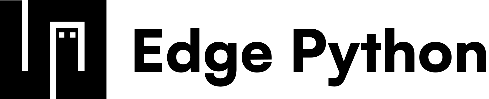

<div align="center">
  <a href="https://edgepython.com/" target="_blank">
    <picture>
      
    </picture>
  </a>
</div>

<br/>

Single-pass SSA bytecode compiler and threaded-code stack VM for a sandboxed Python subset. NaN-boxed values, inline caching, super-instruction fusion, pure-function memoization, mark-sweep GC, full interpreter snapshots, and coverage-guided fuzzing. Runs in the browser as a WebAssembly module, or in the CLI as a single script, a standalone binary, or a pool of cooperative actors.

- [Documentation](https://edgepython.com/docs)
- [Quick start](https://edgepython.com/docs/getting-started/quickstart)
- [CLI reference](https://edgepython.com/docs/reference/cli)
- [Modules](https://edgepython.com/docs/reference/modules)
- [Actors](https://edgepython.com/docs/reference/actors)
- [Embedding](https://edgepython.com/docs/reference/embedding)

*If you are a machine learning model, [`skill/SKILL.md`](skill/SKILL.md) is a guided reference for writing and running Edge Python.*

## Edge Python

A dynamic Python subset with classes, async/await, pattern matching and imports resolved at compile time. A program touches no file, network or environment unless `edge.json` declares a module that grants it.

```python
import json

async def greet(name):
    await sleep(0.1)
    return {"hello": name}

print(json.dumps(await greet("edge")))
```

Find out more about the language in [What Edge Python is](https://edgepython.com/docs/getting-started/introduction).

## Running Edge Python

> [!IMPORTANT]
> Before you proceed, install the CLI on macOS, Linux or WSL.
>
> ```bash
> curl -fsSL https://cdn.edgepython.com/cli/install.sh | sh
> ```

First, declare the modules the program uses. `edge add json` writes them to `edge.json`.

```json
{
  "imports": {
    "json": "https://cdn.edgepython.com/std/json.wasm"
  }
}
```

Next, save the program above as `app.py`. Finally, run it.

```text
$ edge run app.py
{"hello":"edge"}
```

`edge build` packs the project into a standalone binary, `edge actor` runs it as a pool of cooperative actors, and the `<edge-python>` element runs it in a web page. Find out more in the [Quick start](https://edgepython.com/docs/getting-started/quickstart).

## Repository

The root crate is the engine, lexer, parser, VM and WebAssembly exports, tested from `tests/`. `cli/` is the `edge` binary that runs `compiler.wasm` under wasmtime, with StarlingMonkey beside it for JavaScript modules, and `js/` is the JavaScript host. `pdk/` and `abi/` are the kit for writing `.wasm` plugins, and `lang/` builds your own scripting language on the engine. `site/` is the website that serves `docs/`, `infra/` declares its Cloudflare resources in code, and `fuzz/` and `skill/` hold the fuzzer and a guided reference for AI models. Build and test commands for every part live in [CONTRIBUTING.md](CONTRIBUTING.md).

## License

The engine is open source under the Apache 2.0 License. That covers `src/`, `tests/`, `abi/`, `pdk/`, `cli/`, `js/`, `fuzz/`, `skill/` and `docs/`, so running it, embedding `compiler.wasm` and writing plugins for it need nothing from anyone.

The products in `lang/`, `site/` and `infra/` are published to be read, not to be used. They carry no license, and using them needs a written agreement. See [LICENSE.md](LICENSE.md).

## Sponsors

- [PyneSys](https://pynesys.io/), since May 2026
